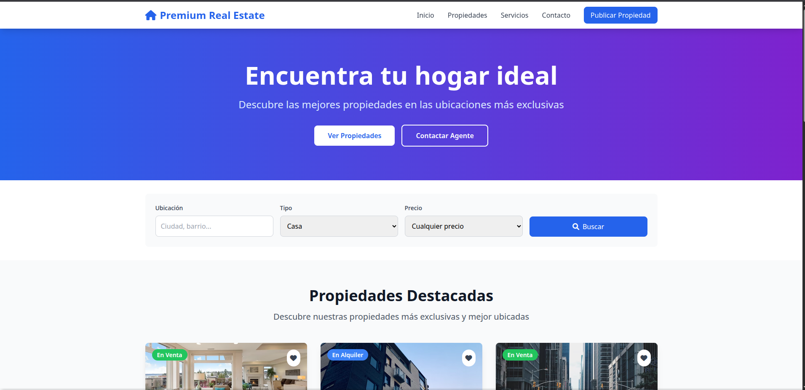
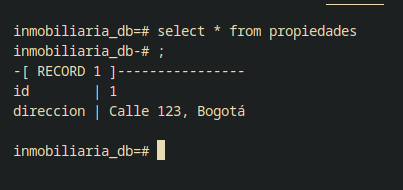

# Proyecto Inmobiliaria con Docker

## Equipo 2

- Francisco Leiva
- Guillermo Torres

## Descripción

Este proyecto implementa una aplicación web inmobiliaria utilizando Docker para la containerización. La aplicación consta de un frontend desarrollado con HTML, CSS (Tailwind) y JavaScript, servido por Nginx, junto con una base de datos PostgreSQL.

## Arquitectura

- **Frontend**: Página web estática servida por Nginx
- **Base de datos**: PostgreSQL para persistencia de datos
- **Orquestación**: Docker Compose para gestión de servicios

## Instalación y Uso

### Prerrequisitos

- Docker
- Docker Compose

### Comandos de ejecución

```bash
# Ejecutar en segundo plano
docker compose up -d --build
```

### Acceso a la aplicación

- **Aplicación web**: http://localhost:8080
- **Base de datos**: Puerto 5432 (interno)

---

## Preguntas Frecuentes sobre Docker

### ¿Cuál es la diferencia entre una imagen y un contenedor?

**Imagen Docker:**

- Es una plantilla de solo lectura que contiene el código de la aplicación, dependencias, bibliotecas y configuraciones necesarias
- Se puede considerar como una "fotografía" del estado de una aplicación en un momento determinado
- Las imágenes se construyen a partir de un Dockerfile
- Son inmutables: una vez creadas, no cambian
- Pueden ser compartidas y reutilizadas

**Contenedor Docker:**

- Es una instancia en ejecución de una imagen Docker
- Agrega una capa de escritura sobre la imagen de solo lectura
- Puede ser iniciado, detenido, movido y eliminado
- Cada contenedor es un proceso aislado con su propio sistema de archivos, red y espacio de procesos
- Múltiples contenedores pueden ejecutarse desde la misma imagen

**Analogía:** Si la imagen es como una receta de cocina, el contenedor es el plato preparado siguiendo esa receta.

### ¿Qué beneficios aporta Docker Compose frente a ejecutar contenedores por separado?

**Gestión simplificada:**

- Permite definir y gestionar múltiples servicios desde un solo archivo YAML
- Elimina la necesidad de recordar comandos largos de `docker run`
- Facilita la reproducibilidad del entorno en diferentes máquinas

**Orquestación de servicios:**

- Gestiona automáticamente las dependencias entre servicios
- Permite el arranque ordenado de contenedores (ej: base de datos antes que aplicación)
- Proporciona una red compartida automática entre servicios

**Escalabilidad y mantenimiento:**

- Facilita el escalado horizontal de servicios específicos
- Simplifica las actualizaciones y el versionado
- Permite configuraciones específicas por entorno (desarrollo, testing, producción)

**Volúmenes y redes:**

- Gestiona automáticamente volúmenes compartidos
- Crea redes internas para comunicación segura entre servicios
- Facilita la persistencia de datos

### ¿Qué mecanismos de seguridad podrías aplicar en esta arquitectura?

**Seguridad de contenedores:**

- Ejecutar contenedores con usuarios no privilegiados
- Implementar límites de recursos (CPU, memoria) para prevenir ataques DoS
- Escanear imágenes en busca de vulnerabilidades conocidas (trivy)
- Utilizar imágenes base oficiales y actualizadas

**Seguridad de red:**

- Configurar redes personalizadas para aislar servicios
- Implementar firewalls para controlar tráfico entrante y saliente
- Utilizar HTTPS/TLS para cifrar comunicaciones
- Configurar reverse proxy con Nginx para ocultar servicios internos

**Gestión de secretos:**

- Utilizar Docker Secrets o variables de entorno cifradas
- Implementar rotación automática de credenciales
- Evitar hardcodear contraseñas en el código o Dockerfiles
- Utilizar herramientas como HashiCorp Vault para gestión de secretos

**Seguridad de base de datos:**

- Configurar autenticación robusta
- Implementar cifrado en reposo y en tránsito
- Realizar backups cifrados regulares
- Aplicar principio de menor privilegio en permisos de usuario

**Monitoreo y auditoría:**

- Implementar logging centralizado
- Configurar alertas de seguridad
- Realizar auditorías regulares de contenedores
- Implementar detección de intrusiones

### ¿Cómo podrías extender este entorno para simular una app completa?

**Backend API:**

- Agregar un servicio de API REST/GraphQL (Node.js, Python, Java)
- Implementar autenticación y autorización (JWT, OAuth)
- Crear endpoints para gestión de propiedades, usuarios y transacciones
- Integrar validación de datos y manejo de errores

**Servicios adicionales:**

- **Cache**: Redis para mejorar rendimiento de consultas frecuentes
- **Cola de mensajes**: RabbitMQ o Apache Kafka para procesos asíncronos
- **Motor de búsqueda**: Elasticsearch para búsquedas avanzadas de propiedades
- **Almacenamiento de archivos**: MinIO para gestión de imágenes de propiedades

## Imagenes referenciales

### Front

## 

### Base de Datos



## Explicación de comunicación entre contenedores

Los contenedores de docker se encuentran isolados por defecto, salvo que se abran sus puertos para poder exponerse, dentro de los archivosa de docker compose se puede crear una red para que los contenedores puedan comunicarse entre ellos, hjaciendo que inclusive esta conexión entre contenedores no pueda accederse desde el exerior si así se desea.
